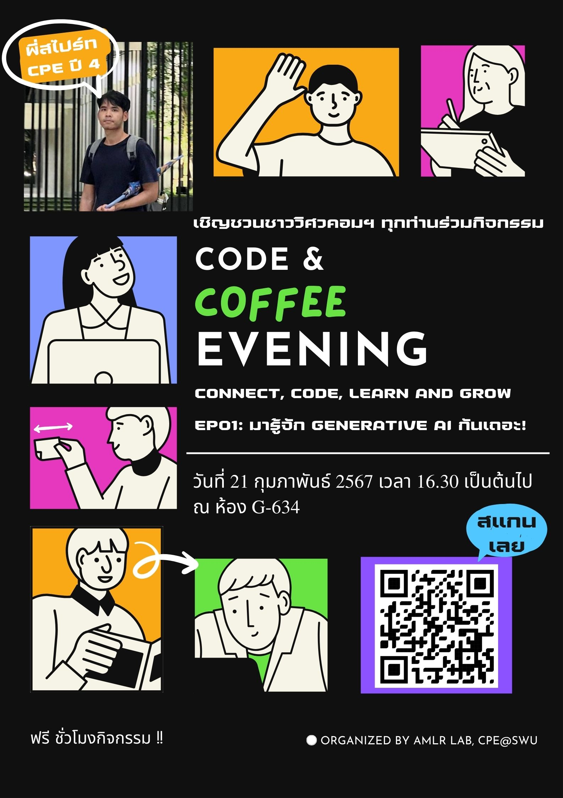

## Code and Coffee Evening Series

We are thrilled to introduce the "Code and Coffee Evening Series," a set of informal meetups designed to bring together coding enthusiasts to share ideas, discuss the latest trends in technology, and enjoy some great coffee. Here’s a glimpse into our recent episodes:

### EP01: มารู้จัก Generative AI กันเถอะ!

**Date:** 21 Febuary 2024

- **Speaker:** P'Sprite (CPE_Y4)
- **Photo Gallery:** [Link to photos from the event](URL_to_photo_gallery)
